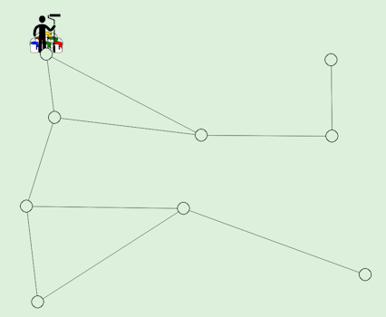

# Problem Description
## The Input
- Given is a connected planar graph with $n$ vertices and $m$ edges.
- One of the vertices is labeled as the *start node*
- Some of the vertices are labeled as *source nodes*.

## The Goal 
The goal is to generate a plan (a sequence of actions) for a painter agent that can travel on the graph along the edges and paint the vertices.

## The Rules
- There are four colors available
- Adjacent vertices (connected by an edge) must be painted with different colors
- The painter agent can carry at most two buckets of paint
- The painter agent starts on the *start node* and he is not carrying any buckets. In each step they can perform one of the following three kinds of actions
  - color the vertex where the painter is located with a certain color. The painter must carry a bucket with that color and it will be consumed after the action.
  - move to an adjacent vertex that is not yet painted (a vertex that has been once painted cannot be entered anymore)
  - collect a bucket with a certain color of paint. The painter has to be located on vertex labeled as *source node*

## Example
The following graph has 9 vertices and 10 edges. The top left vertex (vertex 0) is the start node and also the only source node.



One possible solution is shown in the following anination.


### Input Format

The input description file for the example

```
nodes 9
start-node 0
source-node 0
node (0, 0.14745706786885482, 0.16574725026572554)
node (1, 0.16664104711248381, 0.3475933686258701)
node (2, 0.10108604430900679, 0.604142115873003)
node (3, 0.12740481394783315, 0.8810348052235083)
node (4, 0.5058190047753348, 0.3994654419205334)
node (5, 0.46453027947101033, 0.6106721458591435)
node (6, 0.8058824327410866, 0.18188201278420804)
node (7, 0.8074609633635877, 0.4020278837426875)
node (8, 0.8842403367812561, 0.8018604300312002)
e 0 1
e 7 4
e 4 0
e 2 1
e 5 8
e 1 4
e 6 7
e 3 2
e 2 5
e 3 5
```

Input file contain the following kinds of line
- a single line starting with "nodes" declaring the number of vertices in the graph, the are labeled as $0, ..., n-1$.
- a single line starting with "start-node" declaring the label of the start node (usually 0).
- at least one line starting with "source-node" declaring that a certain is a source node, i.e., a node where the painter can refill.
- lines starting with "node" providing x,y coordinates of the nodes. Only relevant for visualization.
- lines starting with "e" declaring edges between a pair of vertices

### The Output Format

We demonstrate the output format using our running example. The solution plan for our problem (also shown in the animation above) is the following.

```
FILLCONTAINER PAINTER0 ROOM0 CONTAINER0 COLOR3
FILLCONTAINER PAINTER0 ROOM0 CONTAINER1 COLOR2
MOVE PAINTER0 ROOM0 ROOM1
MOVE PAINTER0 ROOM1 ROOM2
MOVE PAINTER0 ROOM2 ROOM3
PAINT PAINTER0 ROOM3 COLOR2 CONTAINER1
MOVE PAINTER0 ROOM3 ROOM5
MOVE PAINTER0 ROOM5 ROOM8
PAINT PAINTER0 ROOM8 COLOR3 CONTAINER0
MOVE PAINTER0 ROOM8 ROOM5
MOVE PAINTER0 ROOM5 ROOM2
MOVE PAINTER0 ROOM2 ROOM1
MOVE PAINTER0 ROOM1 ROOM0
FILLCONTAINER PAINTER0 ROOM0 CONTAINER0 COLOR3
FILLCONTAINER PAINTER0 ROOM0 CONTAINER1 COLOR2
MOVE PAINTER0 ROOM0 ROOM4
MOVE PAINTER0 ROOM4 ROOM7
MOVE PAINTER0 ROOM7 ROOM6
PAINT PAINTER0 ROOM6 COLOR3 CONTAINER0
MOVE PAINTER0 ROOM6 ROOM7
PAINT PAINTER0 ROOM7 COLOR2 CONTAINER1
MOVE PAINTER0 ROOM7 ROOM4
MOVE PAINTER0 ROOM4 ROOM0
FILLCONTAINER PAINTER0 ROOM0 CONTAINER0 COLOR3
FILLCONTAINER PAINTER0 ROOM0 CONTAINER1 COLOR1
MOVE PAINTER0 ROOM0 ROOM4
PAINT PAINTER0 ROOM4 COLOR1 CONTAINER1
MOVE PAINTER0 ROOM4 ROOM0
FILLCONTAINER PAINTER0 ROOM0 CONTAINER1 COLOR1
MOVE PAINTER0 ROOM0 ROOM1
MOVE PAINTER0 ROOM1 ROOM2
MOVE PAINTER0 ROOM2 ROOM5
PAINT PAINTER0 ROOM5 COLOR1 CONTAINER1
MOVE PAINTER0 ROOM5 ROOM2
PAINT PAINTER0 ROOM2 COLOR3 CONTAINER0
MOVE PAINTER0 ROOM2 ROOM1
MOVE PAINTER0 ROOM1 ROOM0
FILLCONTAINER PAINTER0 ROOM0 CONTAINER0 COLOR3
FILLCONTAINER PAINTER0 ROOM0 CONTAINER1 COLOR2
PAINT PAINTER0 ROOM0 COLOR3 CONTAINER0
MOVE PAINTER0 ROOM0 ROOM1
PAINT PAINTER0 ROOM1 COLOR2 CONTAINER1
```

The are are three kinds of actions:
- FILLCONTAINER - action to restock on color for the painter. It has the following arguments:
  - PAINTER - which painter is filling his container, since we only allow one painter, this will be allways "PAINTER0"
  - ROOM - at which refill location
  - CONTAINER - which of the two containers is being filled, either CONTAINER0 or CONTAINER1
  - COLOR - which is to be refilled, one of COLOR0, COLOR1, COLOR2, COLOR3
- MOVE - action to move the painter along an edge. It has the following arguments:
  - PAINTER - which painter is moving, since we only allow one painter, this will be allways "PAINTER0"
  - ROOM - from which location
  - ROOM - to which location
- PAINT - action to paint a room. It has the following arguments:
  - PAINTER - which painter is painting, since we only allow one painter, this will be allways "PAINTER0"
  - ROOM - which location is being painter
  - COLOR - which color is being used, one of COLOR0, COLOR1, COLOR2, COLOR3
  - CONTAINER - which of the two containers is used, either CONTAINER0 or CONTAINER1
